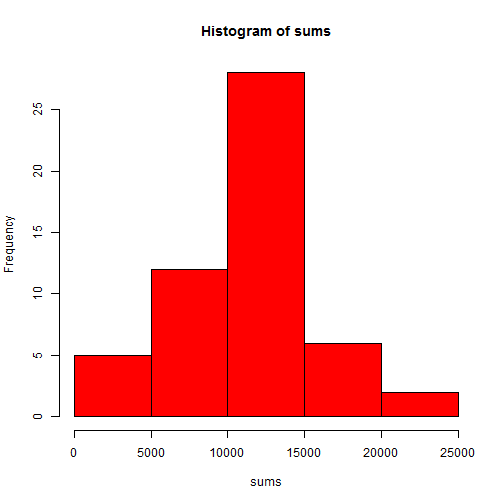
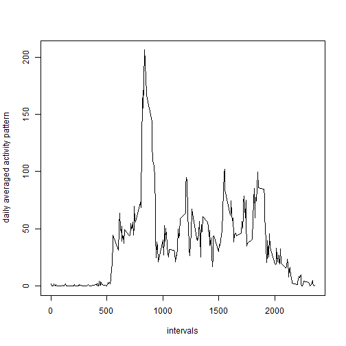
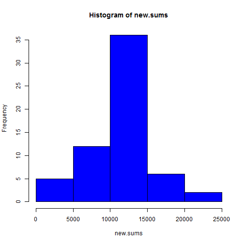

# Reproducible Research: Peer Assessment 1


## Loading and preprocessing the data

```r
setwd("C:/Minqiang/CourseRA/Reproducible_Research_Peng/RepData_PeerAssessment1")
data <- read.csv("activity.csv")
data <- transform(data, date = as.Date(date, "%Y-%m-%d"))
tail(data)
```

```
##       steps       date interval
## 17563    NA 2012-11-30     2330
## 17564    NA 2012-11-30     2335
## 17565    NA 2012-11-30     2340
## 17566    NA 2012-11-30     2345
## 17567    NA 2012-11-30     2350
## 17568    NA 2012-11-30     2355
```


## What is mean total number of steps taken per day?
A histogram of the total number of steps taken each day:


```r
sums <- tapply(data$steps, data$date, sum)
hist(sums, col = "Red")
```

 

```r

mean(sums, na.rm = TRUE)
```

```
## [1] 10766
```

```r
median(sums, na.rm = TRUE)
```

```
## [1] 10765
```


There are a total of 61 days. The mean of total steps taken each day is 1.0766 &times; 10<sup>4</sup> and the median is 10765.

## What is the average daily activity pattern?

A time series plot (i.e. type = "l") of the 5-minute interval (x-axis) and the average number of steps taken, averaged across all days (y-axis):


```r
data <- transform(data, modified.steps = steps)  # makes a copy of steps so we keep original data
data$modified.steps[is.na(data$modified.steps)] <- 0

nums.completecases <- tapply(data$steps, data$interval, function(x) {
    sum(!is.na(x))
})
sum.means <- tapply(data$modified.steps, data$interval, sum)
means = sum.means/nums.completecases
intervals <- as.numeric(names(sum.means))
plot(intervals, means, type = "l", ylab = "daily averaged activity pattern")
```

 


We now look at the maximum of the graph above.


```r
max.pos <- which.max(means)
(max.means <- means[max.pos])
```

```
##   835 
## 206.2
```


The maxium daily averaged activity happens at interval 835 with the maximum value
equal to 206.1698.

## Imputing missing values

Note that there are a number of days/intervals where there are missing values (coded as NA). The presence of missing days may introduce bias into some calculations or summaries of the data.


```r
(num.missingvalues <- sum(!complete.cases(data)))
```

```
## [1] 2304
```


Therefore, the total number of missing values in the dataset (i.e. the total number of rows with NAs)
is 2304.

We now use a strategy for filling in all of the missing values in the dataset by using the mean for that 5-minute interval.
We then create a new dataset that is equal to the original dataset but with the missing data filled in.


```r
new.data <- transform(data, modified.steps = steps)  # makes a copy of steps so we keep original data
for (i in 1:length(new.data$modified.steps)) {
    if (is.na(new.data$steps[i])) {
        new.data$modified.steps[i] <- means[as.character(data$interval[i])]
    }
}
```


We now make a histogram of the total number of steps taken each day and Calculate and report the mean and median total number of steps taken per day:


```r
new.sums <- tapply(new.data$modified.steps, new.data$date, sum)
hist(new.sums, col = "Blue")
```

 

```r

mean(new.sums)
```

```
## [1] 10766
```

```r
median(new.sums)
```

```
## [1] 10766
```


These values do not seem to differ much from the estimates from the first part of the assignment.
However, comparing the two histograms above, we see that the middle bar of the histogram is now considerablly higher. Therefore, the distributions seem to be different. Since the difference happens at the middle of 
the histogram, the mean and median have not been affected much.


## Are there differences in activity patterns between weekdays and weekends?

To answer this question, I first create a data frame "avg.data" to record the means and whether 
it is weekday or weekend.


```r
weekday_fun <- function(aDate) {
    if (aDate == "Sunday" | aDate == "Saturday") 
        return("weekend") else return("weekday")
}

week.day <- sapply(weekdays(data$date), weekday_fun)
library(lattice)
new.data <- data.frame(new.data, week.day)
split.data <- split(new.data, week.day)
s1 <- split.data[[1]]
s2 <- split.data[[2]]

means1 <- tapply(s1$modified.steps, s1$interval, mean)
means2 <- tapply(s2$modified.steps, s2$interval, mean)
avg.data1 <- data.frame(as.numeric(means1), as.numeric(rownames(means1)), rep("weekday", 
    length(means1)))
avg.data2 <- data.frame(as.numeric(means2), as.numeric(rownames(means1)), rep("weekend", 
    length(means1)))
names(avg.data1) <- c("avg.steps", "interval", "week.day")
names(avg.data2) <- c("avg.steps", "interval", "week.day")
avg.data <- rbind(avg.data1, avg.data2)
```


I then use the lattice plotting system to plot the graphs:

```r
xyplot(avg.steps ~ interval | week.day, data = avg.data, type = "l", layout = c(1, 
    2), xlab = "Interval", ylab = "Number of steps")
```

 


We can see that the patterns on weekdays and weekends are similar, but there are some detailed differences.
